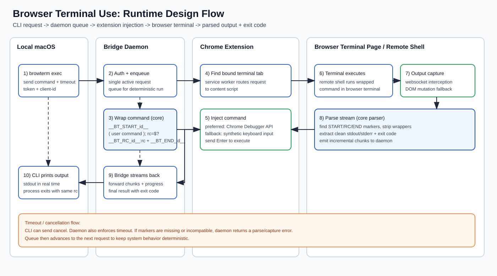

# Browser Terminal Use

<p align="center">
  
</p>

Chrome extension + local daemon + CLI for executing commands in a browser-hosted terminal and returning structured output + exit codes to your local macOS terminal.

中文文档：[`README_zh.md`](README_zh.md)

## What You Get

1. `browterm-daemon` on localhost (`ws://127.0.0.1:17373`).
2. Chrome MV3 extension that:
   - binds to your terminal tab,
   - injects wrapped commands,
   - captures streamed output,
   - extracts command exit code with sentinel markers.
3. `browterm` CLI that:
   - sends commands,
   - streams output in real time,
   - exits with the remote command return code.

## Repository Layout

- `packages/core`: protocol contracts + marker wrapper + parser.
- `packages/bridge`: websocket daemon and request queue.
- `packages/cli`: local CLI (`browterm`).
- `extension`: Chrome extension (MV3).
- `assets/logo`: brand logo assets (SVG + extension icon source).
- `assets/diagrams`: architecture and runtime flow diagrams.
- `DEVELOPMENT.md`: repository development commands.

## Runtime Design



### End-to-End Execution Flow

1. Local CLI (`browterm`) sends an `exec` request with command, timeout, and client metadata to the daemon.
2. Bridge daemon authenticates the request, enqueues it, and guarantees single-active execution.
3. Bridge uses `@browser-terminal-use/core` to wrap the user command with unique start/rc/end markers.
4. Chrome extension service worker routes the wrapped command to the currently bound terminal tab.
5. Content script injects command input into terminal UI, preferring Chrome Debugger API and falling back to synthetic input when needed.
6. Browser terminal executes the wrapped command on the remote shell side.
7. Extension captures output stream (websocket-first, DOM fallback), then parser isolates marker boundaries.
8. Bridge receives parsed chunks + exit code, streams output back to CLI, and finalizes with the same remote return code.

### Queue, Timeout, and Cancel Semantics

1. Requests are serialized in the daemon queue to avoid cross-command contamination on one terminal tab.
2. `--timeout-ms` is enforced server-side; timeout ends active request and unblocks queue.
3. `browterm cancel <requestId>` can abort active or queued requests.
4. If marker parsing fails, daemon returns a capture/compatibility error instead of hanging indefinitely.

## Install and Run (macOS + Chrome)

### 1. Prerequisites

1. macOS with Node.js 20+ (tested with Node 22).
2. Google Chrome (Developer mode enabled for extension loading).
3. Access to the target browser terminal page.

### 2. Install CLI and daemon

```bash
npm install -g @browser-terminal-use/bridge @browser-terminal-use/cli
```

### 3. Start Local Bridge Daemon

Run daemon on localhost:

```bash
browterm-daemon --host 127.0.0.1 --port 17373
```

Optional flags:

```bash
--token <token>           # optional, use it for stronger security (must match extension/CLI)
--default-timeout-ms 120000
--max-timeout-ms 600000
--ping-interval-ms 15000
--debug
```

Health endpoint:

```bash
curl http://127.0.0.1:17373/v1/health
```

### 4. Load Chrome Extension

1. Open `chrome://extensions`.
2. Enable **Developer mode**.
3. Click **Load unpacked**.
4. Select the repository `extension/` directory.

### 5. Configure Extension

1. Open extension options page.
2. Set:
   - **Bridge URL**: `ws://127.0.0.1:17373/extension`
3. Save.

### 6. Bind Terminal Tab

1. Open your web terminal page in Chrome.
2. Refresh that tab once after loading/updating the extension.
3. Click the extension icon once.
4. This sets the current tab as the preferred execution target.

### 7. Use CLI

Health check:

```bash
browterm health
```

Execute command:

```bash
browterm exec "uname -a"
```

JSON mode:

```bash
browterm exec --json "ls -la"
```

Cancel running request:

```bash
browterm cancel <requestId>
```

### 8. Expected Behavior

1. CLI streams terminal output in real-time.
2. CLI exits with the same return code as remote command.
3. Bridge queues requests and runs one command at a time.

### 9. Troubleshooting

#### `execution failed: extension is not connected`

- Verify daemon is running.
- Verify extension options URL.
- Ensure extension service worker is active (open extensions page if needed).

#### `no terminal tab available`

- Open terminal tab.
- Click extension icon to bind tab.
- Refresh the terminal tab once, then retry.

#### Command hangs or no output

- Terminal may use unsupported websocket protocol/encoding.
- Try rebinding tab and rerun.
- Enable daemon `--debug` and inspect logs.

#### Chrome debugger permission prompt appears

- The extension uses Chrome Debugger API for trusted input injection.
- On first use, allow the prompt to enable reliable command delivery.

#### Output contains marker fragments

- Parser could not cleanly isolate marker boundaries from terminal stream framing.
- Re-run once; if persistent, tune wrapper/parser for that terminal vendor's framing format.

## CLI Reference

```bash
browterm health
browterm exec [--timeout-ms N] [--json] [--request-id ID] "<command>"
browterm cancel <requestId>
```

Global options:

```bash
--host <host>       # default 127.0.0.1
--port <port>       # default 17373
--token <token>     # optional, use it for stronger security (must match daemon/extension)
--client-id <id>    # stable ID for cross-session cancel
```

## Design Notes

1. Exit code is captured by wrapping each command with unique markers:
   - `__BT_START_<id>__`
   - `__BT_RC_<id>__:<code>`
   - `__BT_END_<id>__`
2. Extension captures output primarily from page websocket traffic.
3. DOM mutation capture is a fallback if websocket capture is unavailable.
4. Bridge serializes execution requests (single active command) for deterministic behavior.

## Security Baseline

1. Daemon binds to localhost only.
2. Extension + CLI communicate only through the local daemon.
3. Extension requires explicit tab binding for reliable target control.

## Known Limitations

1. Browser terminal implementations vary; websocket encoding may be proprietary in some products.
2. Some terminal UIs may block synthetic keyboard input fallback.
3. Cross-origin iframe terminals can reduce observability depending on page constraints.
4. Truly interactive TUIs are not fully supported (current model is command-oriented, not full PTY mirroring).

## Development

For repository build/test/run commands, see `DEVELOPMENT.md`.
