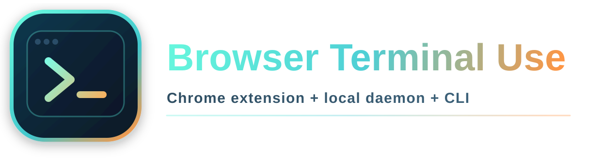
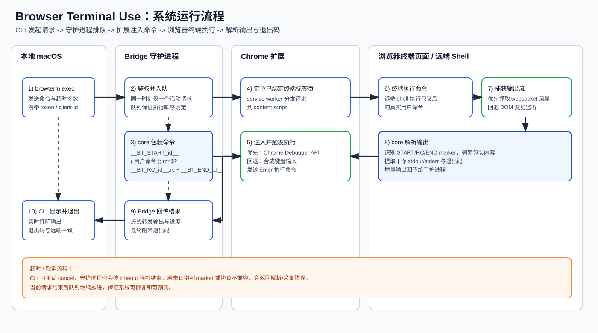

# Browser Terminal Use（中文）

<p align="center">
  
</p>

这是一个用于浏览器网页终端自动化的工具集：由 Chrome 扩展、本地守护进程和 CLI 组成，可在本地终端下发命令到浏览器终端，并获得实时输出与退出码。

English README: [`README.md`](README.md)

## 工具价值

- Agent 优先：让本地 LLM Agent 的循环迭代，能够直接驱动云端浏览器终端执行。
- 云端可验证执行：通过流式输出与退出码一致性，把远端执行过程在本地自动化链路中做到可观测、可审计。
- 复杂非本地环境调试实用：不止 GPU，也适用于各类远端复杂环境（如云端 GPU、容器集群、需跳板访问的网络环境），同时保持本地前沿模型的快速迭代调试闭环。

## 你将获得

1. 运行在本机的 `browterm-daemon`（`ws://127.0.0.1:17373`）。
2. Chrome MV3 扩展，负责：
   - 绑定终端标签页，
   - 注入包装后的命令，
   - 捕获流式输出，
   - 通过标记提取退出码。
3. `browterm` CLI，支持：
   - 下发命令，
   - 实时输出流式回显，
   - 以远端命令退出码作为本地进程退出码。

## 仓库结构

- `packages/core`：协议定义、命令包装、输出解析。
- `packages/bridge`：WebSocket 守护进程与请求队列。
- `packages/cli`：本地 CLI（`browterm`）。
- `extension`：Chrome 扩展（MV3）。
- `assets/logo`：品牌标识资源（SVG 与扩展图标源文件）。
- `assets/diagrams`：架构与运行流程图。
- `DEVELOPMENT_zh.md`：仓库开发命令说明。

## 系统运行流程设计



### 端到端执行流程

1. 本地 CLI（`browterm`）将命令、超时与客户端信息发送到守护进程。
2. Bridge 守护进程完成鉴权并入队，保证同一时刻只执行一个请求。
3. Bridge 调用 `@browser-terminal-use/core`，为用户命令添加唯一的 start/rc/end 标记。
4. Chrome 扩展 service worker 将包装后的命令分发到当前已绑定的终端标签页。
5. Content script 向终端页面注入输入，优先使用 Chrome Debugger API，失败时回退到合成输入。
6. 浏览器终端在远端 shell 中执行包装后的命令。
7. 扩展捕获输出流（优先 websocket，回退 DOM），解析器按 marker 抽取有效输出与退出码。
8. Bridge 将解析后的流式输出和最终退出码返回 CLI，并以远端退出码结束本地进程。

### 队列、超时与取消语义

1. 守护进程串行执行请求，避免同一终端标签页上的命令互相污染。
2. `--timeout-ms` 在服务端强制生效，超时后结束当前请求并推进队列。
3. `browterm cancel <requestId>` 可取消运行中或排队中的请求。
4. 若 marker 解析失败，守护进程会返回采集/兼容性错误，而不是无限挂起。

## 安装与运行指南（macOS + Chrome）

### 1. 前置条件

1. macOS 系统，Node.js 20+（已在 Node 22 环境验证）。
2. Google Chrome（需要开启开发者模式以加载本地扩展）。
3. 可访问目标网页终端（Browser Terminal）页面。

### 2. 安装 CLI 和守护进程

```bash
npm install -g @browser-terminal-use/bridge @browser-terminal-use/cli
```

### 3. 启动本地 Bridge 守护进程

在本机 `localhost` 启动守护进程：

```bash
browterm-daemon --host 127.0.0.1 --port 17373
```

可选参数：

```bash
--token <token>           # 可选，可用于提高安全性（需与扩展/CLI 一致）
--default-timeout-ms 120000
--max-timeout-ms 600000
--ping-interval-ms 15000
--debug
```

健康检查接口：

```bash
curl http://127.0.0.1:17373/v1/health
```

### 4. 在 Chrome 加载扩展

1. 打开 `chrome://extensions`。
2. 打开右上角 **开发者模式**。
3. 点击 **加载已解压的扩展程序**。
4. 选择仓库中的 `extension/` 目录。

### 5. 配置扩展

1. 打开扩展的设置页面（Options）。
2. 填写：
   - **Bridge URL**: `ws://127.0.0.1:17373/extension`
3. 点击保存。

### 6. 绑定终端标签页

1. 在 Chrome 打开你的网页终端页面。
2. 在加载或更新扩展后，先刷新一次该终端页面。
3. 点击一次扩展图标。
4. 当前标签页会被设置为优先执行目标。

### 7. 使用 CLI

健康检查：

```bash
browterm health
```

执行命令：

```bash
browterm exec "uname -a"
```

JSON 输出模式：

```bash
browterm exec --json "ls -la"
```

取消运行中的请求：

```bash
browterm cancel <requestId>
```

### 8. 预期行为

1. CLI 实时流式输出浏览器终端执行结果。
2. CLI 进程退出码与远端命令退出码一致。
3. Bridge 会排队请求，并且同一时刻只执行一个命令。

### 9. 故障排查

#### `execution failed: extension is not connected`

- 确认 Bridge 守护进程正在运行。
- 确认扩展中的 URL 配置正确。
- 确认扩展 service worker 已激活（可打开扩展管理页触发）。

#### `no terminal tab available`

- 先打开终端页面。
- 点击扩展图标绑定该标签页。
- 刷新该终端页面后再重试。

#### 命令卡住或无输出

- 某些终端产品使用了不兼容的 websocket 协议或编码。
- 尝试重新绑定标签页后再执行。
- 使用 Bridge 的 `--debug` 查看日志。

#### 首次执行时出现 Chrome 调试权限提示

- 扩展会使用 Chrome Debugger API 注入可信输入（提升兼容性）。
- 首次触发时如出现权限弹窗，请点允许。

#### 输出中出现 marker 字符串

- 说明解析器未完全隔离终端流中的标记边界。
- 可先重试；若稳定复现，需要按目标终端协议调整解析逻辑。

## CLI 参考

```bash
browterm health
browterm exec [--timeout-ms N] [--json] [--request-id ID] "<command>"
browterm cancel <requestId>
```

全局参数：

```bash
--host <host>       # 默认 127.0.0.1
--port <port>       # 默认 17373
--token <token>     # 可选，可用于提高安全性（需与守护进程/扩展一致）
--client-id <id>    # 跨会话取消时使用的稳定客户端 ID
```

## 设计说明

1. 通过唯一 marker 包装命令获取退出码：
   - `__BT_START_<id>__`
   - `__BT_RC_<id>__:<code>`
   - `__BT_END_<id>__`
2. 扩展优先从页面 websocket 流量中抓取输出。
3. 若 websocket 抓取不可用，则回退到 DOM 变更观察。
4. Bridge 串行执行请求（同一时刻只跑一个命令），保证行为可预测。

## 安全基线

1. 守护进程仅监听 localhost。
2. 扩展与 CLI 仅通过本地守护进程通信。
3. 扩展需要显式绑定标签页，避免误操作到错误终端。

## 已知限制

1. 不同浏览器终端实现差异大，部分产品 websocket 编码可能是私有协议。
2. 某些终端 UI 可能拦截或拒绝合成输入。
3. 跨域 iframe 终端在部分页面约束下可观测性会下降。
4. 当前模型以“命令执行”为主，不是完整 PTY 镜像，交互式 TUI 支持有限。

## 开发相关

仓库内构建/测试/运行命令请看 `DEVELOPMENT_zh.md`。
